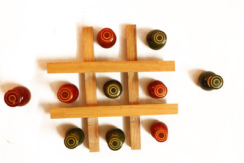

# Tic-Tac-Toe Game

## Description
Tic-tac-toe games consists of Xs and Os for two players, X and O, who take turns marking the spaces in a 3×3 grid. The player who succeeds in placing three of their marks in a horizontal, vertical, or diagonal row is the winner.

## How to Play it
In order to win the game, a player must place three of their marks in a horizontal, vertical, or diagonal row.

### Pseuscode
* Initialize variables
* Create events that handle when the user clicks on  
* A for loop that will reset the game every time the player finishes the game
* If the x player places three of his marks in a horizontal, vertical, or diagonal row. The x player wins.
* If the O player  places three of his marks in a horizontal, vertical, or diagonal row. The O player wins.
* Create functions that check the status of the game

